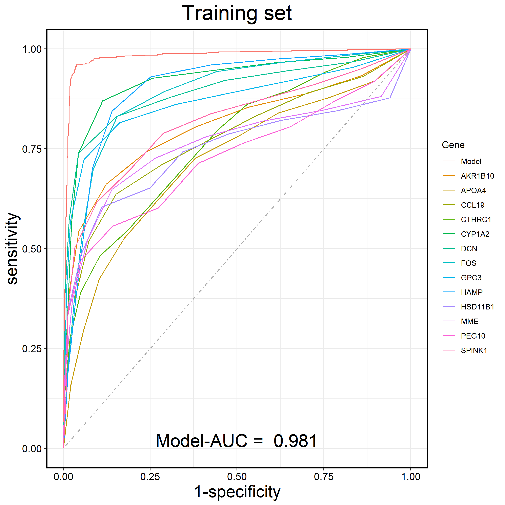
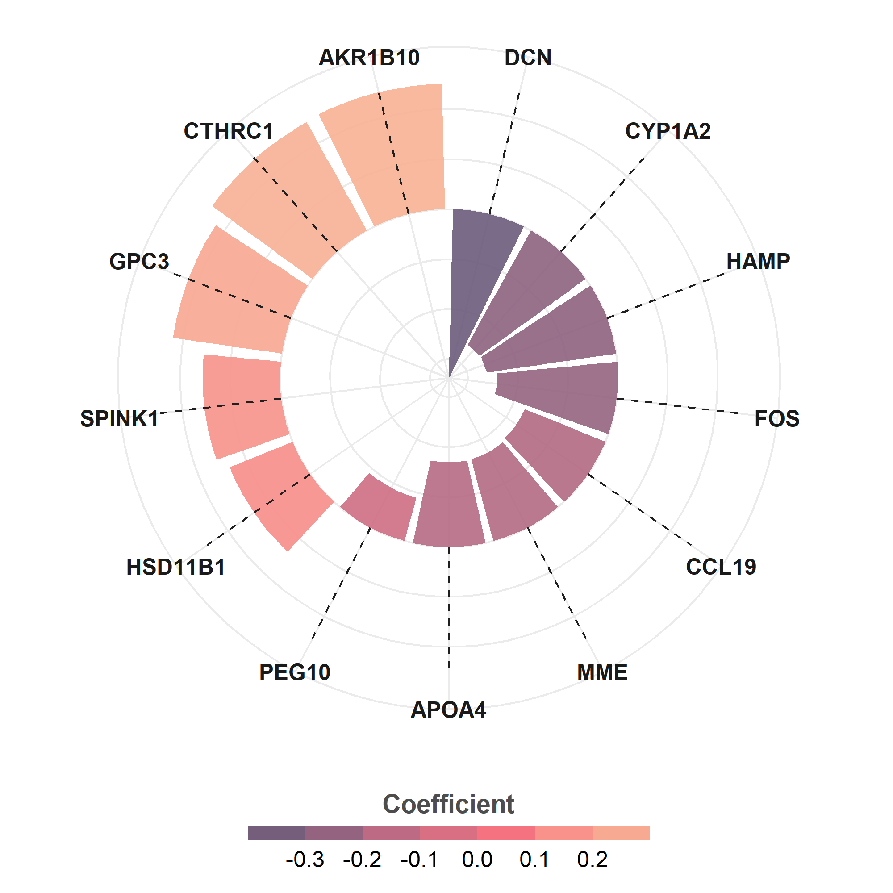
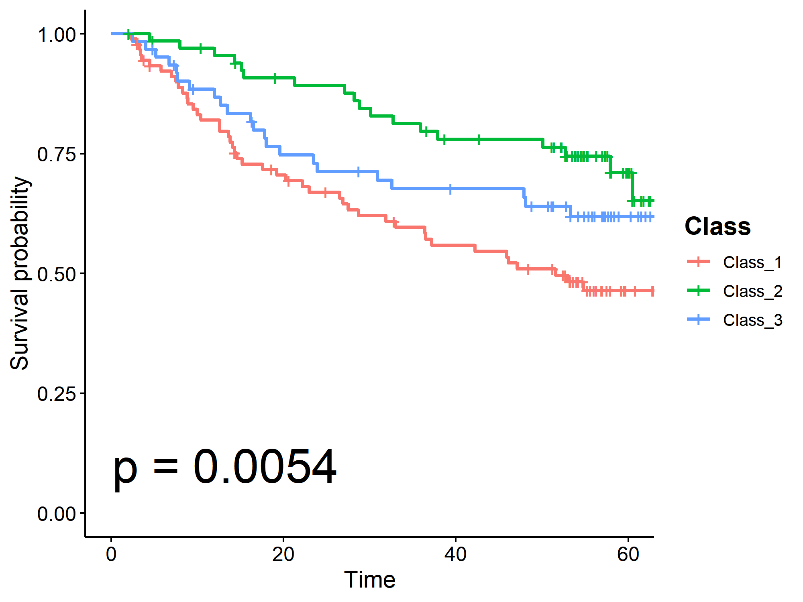

# UniQuant  🧬
🧰 Name: Universal Quantile-Based Transcriptome Integration (R package)  
✍️ Author: Huanhou Su

**Symbol**  
🚩 - Functions  

⭕ - Optional operations  

❓ - Questions  


❌ ❗ ‼️ ⁉️ ⭕ ✖️ ➕ ➖ ➗ ✔️ 👀❗❓


# Quick run  🚀
```
##### 1. Quantile score
## Prepare raw data
# ls_datasset: Name of the dataset.
# df_raw: Raw expression data, with genes as rows and samples as columns.
# dataset_type: 'Training' or 'Validation'.
# df_Disease: The first column is the sample name, the second column is the disease status ('No' represents non-diseased samples, 'Yes' represents diseased samples). If survival information is available, the third column is the survival outcome (0 represents survival, 1 represents death), and the fourth column is the follow-up time (in months). Non-diseased samples do not need to have survival information filled in.
Quantile_score(ls_datasset, df_raw, dataset_type, df_Disease)

##### 2. Select the genes of interest
rst_Hype = UniQuant_Hypervariable_gene(n_hypervariable_gene = 1000)  
interest_gene = rst_Hype$Gene

##### 3. Training and Validation of the Diagnostic Model
rst_dg = UniQuant_Disease_gene(ls_gene = interest_gene)  
Disease_gene = rst_dg$Disease_gene

rst_Training = UniQuant_Model_Training(ls_gene = Disease_gene) 
rst_Validation = UniQuant_Model_Validation()

##### 4. Molecular classification
rst_Class = UniQuant_Class(ls_gene = interest_gene, n_Class = 3)  

##### 5. Subsequent analyses: survival analysis, differential gene expression analysis, enrichment analysis, etc.
```

#####    
  

# Comprehensive Guide  📖
## 0️⃣ Setting
```
library(ggplot2); library(edgeR) ; library(pROC); library(stringr)

dir_main = getwd()
dir_in = file.path(dir_main, '0.raw')
setwd(dir_main); set.seed(100)
```

#####   

## 1️⃣ Quantile score
```
##### Converts raw expression data of a dataset into quantile-based scores and organizes the disease status of the samples.
#### Training set
ls_datassets = c('GSE6764', 'GSE14520', 'GSE17856', 'GSE57957', 'GSE36376','GSE102079', 'GSE54236', 'GSE36411', 'GSE22058')

for (ls_datasset in ls_datassets){
  df_raw = readRDS(file.path(dir_in, paste0(ls_datasset, '_Expression.rds')))
  df_Disease = readRDS(file.path(dir_in, paste0(ls_datasset, '_Disease.rds')))
  Quantile_score(ls_datasset, df_raw, "Training", df_Disease)
}


#### Validation set
ls_datassets = c('PMID31585088', 'PMID35382356', 'GSE77314', 'GSE76427','GSE25097', 'GSE63898', 'GSE39791', 'GSE144269','GSE114564', 'GSE14811')

for (ls_datasset in ls_datassets){
  df_raw = readRDS(file.path(dir_in, paste0(ls_datasset, '_Expression.rds')))
  df_Disease = readRDS(file.path(dir_in, paste0(ls_datasset, '_Disease.rds')))
  Quantile_score(ls_datasset, df_raw, "Validation", df_Disease)
}
```
---


<span style="font-size: 20px;">⭕
**You can also transform individual datasets.**
</span>


```
ls_datasset = 'GSE36376'
df_raw = readRDS(file.path(dir_in, paste0(ls_datasset, '_Expression.rds')))
df_Disease = readRDS(file.path(dir_in, paste0(ls_datasset, '_Disease.rds')))
Quantile_score(ls_datasset, df_raw, "Validation", df_Disease)
```  


<span style="font-size: 20px;">⭕
**The data format of the raw gene expression data is as follows.**
</span>


```
df_raw[1:4, 1:4]
```


<div align="center"> 

|         | GSM890128 | GSM890129 | GSM890130 | GSM890131 |
|:-------------:|:-----------:|:-----------:|:-----------:|:-----------:|
| EEF1A1      | 14.054179 | 14.395189 | 14.349301 | 14.183636 |
| LOC643334   | 6.543733  | 6.399822  | 6.391479  | 6.190396  |
| SLC35E2     | 6.065169  | 6.172510  | 5.957617  | 5.980207  |
| LOC642820   | 6.862825  | 6.699461  | 6.726557  | 6.664170  |

</div>   


<span style="font-size: 20px;">⭕
**The data format of the transformed gene expression data is as follows.**
</span>

<div align="center">  

|             |  GSE36376@GSM890128  |  GSE36376@GSM890129  | GSE36376@GSM890130 | GSE36376@GSM890131 |
|:------------:|:--------------------:|:--------------------:|:--------------------:|:--------------------:|
| EEF1A1      |          4           |          9           | 8                  | 6                  |
| LOC643334   |          10          |          8           | 8                  | 4                  |
| SLC35E2     |          4           |          7           | 2                  | 2                  |
| LOC642820   |          9           |          5           | 6                  | 4                  |

</div>   

<span style="font-size: 20px;">⭕
**The data format for the disease status of the samples is as follows.**
</span>

```
print(rbind(head(df_Disease, 4), tail(df_Disease, 4)))
```
<div align="center">  


| Sample    | Disease |
|:---------:|:-------:|
| GSM890128 | No      |
| GSM890129 | No      |
| GSM890130 | No      |
| GSM890131 | No      |
| GSM890557 | Yes     |
| GSM890558 | Yes     |
| GSM890559 | Yes     |
| GSM890560 | Yes     |

</div>   

<span style="font-size: 20px;">⭕
**If your samples contain survival information, you can add columns for survival status (<code>Outcome</code>: 0 represents survival, 1 represents death) and survival time (<code>Time</code>: months).Note that only diseased samples require the addition of survival information.**
</span>

```
ls_datasset = 'GSE14520'
df_Disease = readRDS(file.path(dir_in, paste0(ls_datasset, '_Disease.rds')))
head(df_Disease, 4)
```

<div align="center">  

| Sample     | Disease | Outcome | Time |
|------------|---------|---------|------|
| GSM362958  | Yes     | 1       | 28.2 |
| GSM362959  | Yes     | 1       | 9.5  |
| GSM362960  | Yes     | 0       | 66.1 |
| GSM362961  | No      |       |    |

</div>   

#####   


## 2️⃣ Select the genes of interest
```R
# Select the hypervariable genes that are expressed across the majority of the datasets.
rst_Hype = UniQuant_Hypervariable_gene(n_hypervariable_gene = 1000, dataset_threshold = 0.7)  
interest_gene = rst_Hype$Gene

interest_gene
 [1] "ACSL4"   "AFP"     "AKR1B10" "ALDH3A1" "APOA4"   "APOF"    "C7"      "C9"      "CCL19"  
[10] "CCL20"   "COL1A1"  "CRP"     "CTHRC1"  "CYP1A2"  "CYP3A4"  "DCN"     "DHRS2"   "DKK1"   
[19] "DLK1"    "EPCAM"   "FCN3"    "FOS"     "FOSB"    "GPC3"    "GPR88"   "HAMP"    "HSD11B1"
[28] "IFI27"   "LCN2"    "LUM"     "MME"     "MMP7"    "MT1M"    "MUC13"   "MYH4"    "NQO1"   
[37] "NTS"     "PAGE4"   "PEG10"   "PGC"     "PLA2G2A" "REG3A"   "RELN"    "S100P"   "SDS"    
[46] "SLC22A1" "SLPI"    "SPINK1"  "SPP1"   
```

<span style="font-size: 20px;">⭕
**You can enter other genes of interest, such as immune genes, metabolic genes, cell cycle genes, etc.**
</span>

#####   

## 3️⃣ Diagnostic model
### 3.1 Disease-related gene
```
rst_dg = UniQuant_Disease_gene(ls_gene = interest_gene, disease_threshold = 0.7)  
Disease_gene = rst_dg$Disease_gene

Disease_gene
 [1] "ACSL4"   "AKR1B10" "APOA4"   "APOF"    "C7"      "C9"      "CCL19"  
 [8] "CCL20"   "CTHRC1"  "CYP1A2"  "CYP3A4"  "DCN"     "FCN3"    "FOS"    
[15] "FOSB"    "GPC3"    "HAMP"    "HSD11B1" "LUM"     "MME"     "MT1M"   
[22] "MUC13"   "PEG10"   "SDS"     "SLC22A1" "SPINK1" 
```
---

### 3.2 Training diagnostic model

```
rst_Training = UniQuant_Model_Training(ls_gene = Disease_gene) 

names(rst_Training)
[1] "Model_gene"     "AUC"            "Cutoff"         "Coefficient"   
[5] "ROC_Model_plot" "ROC_Gene_plot"  "ROC_Model_data" "ROC_Gene_data"  

# Model_gene: The genes used to construct the diagnostic model.
# AUC: The AUC value of the diagnostic model in the Training set.
# Cutoff: The sensitivity, specificity, and accuracy performance of the diagnostic model when the threshold is set to 0.5.
# Coefficient: The correlation coefficient of the model genes.
# ROC_Model_plot: The ROC curve plot of the diagnostic model in the Training set.
# ROC_Gene_plot: The ROC curve plot of the diagnostic model and its genes in the Training set.
# ROC_Model_data: The data used to plot the ROC curve of the diagnostic model in the Training set.
# ROC_Gene_data: The data used to plot the ROC curve of the diagnostic model and its genes in the Training set.
```


<span style="font-size: 20px;">⭕
**You can extract the data from <code>rst_Training</code> and plot the receiver operating characteristic (ROC) curve of the diagnostic model for the Training set.**
</span>
```
res = rst_Training$ROC_Gene_data
p = ggroc(res, legacy.axes = TRUE)+
  geom_segment(aes(x = 0, xend = 1, y = 0, yend = 1), color="darkgrey", linetype=4)+
  theme_bw() + 
  ggtitle("Training set")+
  theme(plot.title = element_text(hjust = 0.5,size = 25),
        axis.title.x = element_text(size = 20),
        axis.title.y = element_text(size = 20),
        axis.text=element_text(size=12,colour = "black"),
        panel.border = element_rect(color = "black", fill = NA, size = 1.5), 
        
  ) + labs(colour = "Gene") + 
  annotate("text", x=0.50, y=0.02, size = 7.5, label=paste("Model-AUC = ", round(res$Model$auc,3))); p
```



<span style="font-size: 20px;">⭕
**View the model genes and their corresponding coefficients.**
</span>

```
rst_Training$Coefficient
```  
<div align="center">   

| gene   | coefficient  |
|--------|--------------|
| DCN    | -0.33802661  |
| CYP1A2 | -0.26176605  |
| HAMP   | -0.26145613  |
| FOS    | -0.24085125  |
| CCL19  | -0.17432534  |
| MME    | -0.16998127  |
| APOA4  | -0.16885766  |
| PEG10  | -0.08975637  |
| HSD11B1| 0.13580332   |
| SPINK1 | 0.15481402   |
| GPC3   | 0.21975622   |
| CTHRC1 | 0.24801502   |
| AKR1B10| 0.25147663   |

</div>  

<span style="font-size: 20px;">⭕
**You can extract the model genes and their corresponding coefficients, and visualize the output.**
</span>
```
df_plot = rst_Training$Coefficient
df_plot$gene = df_plot$gene
df_plot$coefficient = round(df_plot$coefficient, 3)


p1 = ggplot(df_plot) +
  geom_col(aes(x = reorder(str_wrap(gene, 8), coefficient),
               y = coefficient, fill = coefficient),
          position = "dodge2",
          show.legend = TRUE, alpha = .9
          ) +
  geom_segment(aes(
      x = reorder(str_wrap(gene, 8), coefficient), y = 0,
      xend = reorder(str_wrap(gene, 8), coefficient), yend = max(coefficient)), 
      linetype = "dashed", color = "gray12") + coord_polar(); p1

p2 = p1 +
  scale_fill_gradientn(
    "Coefficient",
    colours = c( "#6C5B7B","#C06C84","#F67280","#F8B195")
  ) +
  guides(
    fill = guide_colorsteps(
    barwidth = 15, barheight = .5, title.position = "top", title.hjust = .5
    )) + theme_minimal()+
  theme(
    axis.title = element_blank(),
    axis.ticks = element_blank(),
    axis.text.y = element_blank(),
    axis.text.x = element_text(color = "gray10", size = 12, face = "bold"),
    legend.position = "bottom",
    legend.title = element_text(color = "gray30",size = 14, face = "bold"),
    legend.text = element_text(size = 12) 
  ); p2
```



---


### 3.3 Validation of diagnostic model
```
rst_Validation = UniQuant_Model_Validation()

names(rst_Validation)
[1] "AUC"            "Cutoff"         "ROC_Model_plot"
[4] "ROC_Gene_plot"  "ROC_Model_data" "ROC_Gene_data" 

# AUC: The AUC value of the diagnostic model in the Validation set.
# Cutoff: The sensitivity, specificity, and accuracy performance of the diagnostic model when the threshold is set to 0.5.
# ROC_Model_plot: The ROC curve plot of the diagnostic model in the Validation set.
# ROC_Gene_plot: The ROC curve plot of the diagnostic model and its genes in the Validation set.
# ROC_Model_data: The data used to plot the ROC curve of the diagnostic model in the Validation set.
# ROC_Gene_data: The data used to plot the ROC curve of the diagnostic model and its genes in the Validation set.
```


<span style="font-size: 20px;">⭕
**You can extract the data from <code>rst_Validation</code> and plot the receiver operating characteristic (ROC) curve of the diagnostic model for the Validation set.**
</span>
```
rst_Validation$ROC_Gene_plot
```


#####   
## 4️⃣ Molecular classification
### 4.1 Classification 
```
rst_Class = UniQuant_Class(ls_gene = interest_gene, n_Class = 3)  
df_Class = rst_Class$df_Class

# Count the number of samples for each molecular classification
rst_Class$df_Class_table
Class_1 Class_2 Class_3 
    570     690     708 
```


<span style="font-size: 20px;">⭕
**View the molecular classification results of all samples.**
</span>

```
head(df_Class)
```  
<div align="center">   

|         Sample          |   Class   |
|:-----------------------:|:---------:|
|  GSE102079@GSM2723193   |  Class_1  |
|  GSE102079@GSM2723195   |  Class_2  |
|  GSE102079@GSM2723197   |  Class_2  |
|  GSE102079@GSM2723198   |  Class_1  |
|  GSE102079@GSM2723199   |  Class_3  |
|  GSE102079@GSM2723200   |  Class_2  |

</div>  


---

### 4.2 Survival analysis
<span style="font-size: 20px;">⭕
**Analyze the impact of molecular classification on patient survival outcomes in the specified dataset.**
</span>


```
library(survival); library(survminer)  
dir_in = file.path(getwd(), '1.Quantile')  
dir_result = file.path(getwd(), '2.UniQuant')

ls_dataset = 'GSE14520'  

df_Disease = readRDS(file.path(dir_in, paste0(ls_dataset, '@Disease.rds')))
df_Class = readRDS(file.path(dir_result, 'df_Class.rds'))

df_Disease = df_Disease[!is.na(df_Disease$Time),]
df_Class_tmp <- df_Class[df_Class$Sample %in% df_Disease$Sample,]
df_Disease_Class = merge(df_Disease, df_Class_tmp, by = 'Sample')
unique_Class <- as.character(sort(unique(df_Disease_Class$Class)))

sfit = survfit(Surv(Time, Outcome)~Class, data = df_Disease_Class)
p <- ggsurvplot(sfit, pval = TRUE, data = df_Disease_Class, risk.table = FALSE, 
                legend.title = "Class",
                legend.labs = unique_Class,
                legend = "right",
                pval.size = 10,
                pval.coord = c(0.1,0.1),
                palette = c("#F8766D", "#00BA38", "#619CFF")
)

p$plot <- p$plot + theme(legend.title = element_text(face = "bold", size = 15)); p
```




#####   

## 5️⃣ Differential gene expression (DEG) analysis. 

### 5.1 DEG：Disease
```
# Perform DEG analysis based on the disease status of the samples
rst_DEG_Disease = UniQuant_DEG_Disease(dataset_threshold = 0.7)
```
---


### 5.2 DEG：Class
```
# Perform DEG analysis based on the molecular classification of the samples
rst_DEG_Class = UniQuant_DEG_Class(
  input_Class = rst_Class$df_Class,
  Class_test = 'Class_3',  
  Class_control = c('Class_1', 'Class_2'),
  dataset_threshold = 0.7)
```


6️⃣  7️⃣ 8️⃣ 9️⃣

##### 

# All functions 🔧
## Quantile_score
<span style="font-size: 20px;">🚩
Converts raw expression data of a dataset into quantile-based scores and organizes the disease status of the samples.
</span>

<div align="center">

| Parameter           | Type        |                                                                                                                                                                                                                         Description                                                                                                                                                                                                                          |
|:-------------------:|:-----------:|:------------------------------------------------------------------------------------------------------------------------------------------------------------------------------------------------------------------------------------------------------------------------------------------------------------------------------------------------------------------------------------------------------------------------------------------------------------:|
| dataset_name        | Character   |                                                                                                                                                                                                 <div style="white-space: normal;">Name of the dataset.</div>                                                                                                                                                                                                 |
| dataset_expression  | Data.frame  |                                                                                                                                                                           <div style="white-space: normal;">Raw expression data, with genes as rows and samples as columns.</div>                                                                                                                                                                            |
| dataset_type        | Character   |                                                                                                                                                                                         <div style="white-space: normal;">**'Training'** or **'Validation'**.</div>                                                                                                                                                                                          |
| dataset_disease     | Data.frame  | <div style="white-space: normal;">The first column is the sample name, the second column is the disease status ('No' represents non-diseased samples, 'Yes' represents diseased samples). If survival information is available, the third column is the survival status (0 represents survival, 1 represents death), and the fourth column is the follow-up time (in months). Non-diseased samples do not need to have survival information filled in.</div> |

</div>

---
## UniQuant_Hypervariable_gene
<span style="font-size: 20px;">🚩
Select the hypervariable genes that are expressed across the majority of the datasets.
</span>
<div align="center">   

|       Parameter       |   Type    |                                                             Description                                                              |
|:---------------------:|:---------:|:------------------------------------------------------------------------------------------------------------------------------------:|
| n_hypervariable_gene  |  Integer  |          <div style="white-space: normal;">**1-3000**. The number of hypervariable genes selected from each dataset.</div>           |
|   dataset_threshold   |  Numeric  | <div style="white-space: normal;">**0-1.0**. The minimum proportion of datasets in which the selected genes must be expressed.</div> |
</div>   

---
## UniQuant_Disease_gene
<span style="font-size: 20px;">🚩
Select disease-related genes with high AUC from the Training set.
</span>
<div align="center">   

|         Parameter          |     Type     |                                                             Description                                                              |
|:--------------------------:|:------------:|:------------------------------------------------------------------------------------------------------------------------------------:|
|          ls_gene           |    Vector    |                            <div style="white-space: normal;">The vector containing multiple genes.</div>                             |
|     disease_threshold      |   Numeric    | <div style="white-space: normal;">**0-1.0**. The minimum proportion of datasets in which the selected genes must be expressed.</div> |
</div>   

---
## UniQuant_Model_Training
<span style="font-size: 20px;">🚩
Build a disease diagnostic model using the integrated training dataset.
</span>
<div align="center">   

|     Parameter      |    Type    |                                                             Description                                                              |
|:------------------:|:----------:|:------------------------------------------------------------------------------------------------------------------------------------:|
|      ls_gene       |   Vector   |                            <div style="white-space: normal;">The vector containing multiple genes.</div>                             |
| disease_threshold  |  Numeric   | <div style="white-space: normal;">**0-1.0**. The minimum proportion of datasets in which the selected genes must be expressed.</div> |
</div>   

---
## UniQuant_Model_Validation
<span style="font-size: 20px;">🚩
Analyze the performance of the disease diagnostic model using the integrated validation dataset.
</span>

---
## UniQuant_Model_dataset_AUC
<span style="font-size: 20px;">🚩
Analyze the diagnostic performance of the disease diagnostic model across all datasets.
</span>  

---
## UniQuant_Remove_dataset
<span style="font-size: 20px;">🚩
Remove the specified dataset.
</span>
<div align="center">   

|   Parameter   |    Type     |                          Description                           |
|:-------------:|:-----------:|:--------------------------------------------------------------:|
| dataset_name  |  Character  |  <div style="white-space: normal;">Name of the dataset.</div>  |  

</div>   

---
## UniQuant_Class
<span style="font-size: 20px;">🚩
Perform molecular classification of disease samples based on the integrated dataset.
</span>
<div align="center">   

|  Parameter  |  Type   |                                              Description                                              |
|:-----------:|:-------:|:-----------------------------------------------------------------------------------------------------:|
|   ls_gene   | Vector |     <div style="white-space: normal;">A vector containing a list of genes to be processed.</div>      |
|  n_Class  | Integer |      <div style="white-space: normal;">The number of molecular classifications to be used.</div>      |
|  method  | Character | <div style="white-space: normal;">The method for classification, either **'CCP'** or **'NMF'**.</div> |

</div>   

---
## UniQuant_DEG_Disease
<span style="font-size: 20px;">🚩
Perform differential gene expression analysis between disease and non-disease samples.
</span>
<div align="center">   

|      Parameter       |     Type     |                                                             Description                                                              |
|:--------------------:|:------------:|:------------------------------------------------------------------------------------------------------------------------------------:|
|  disease_threshold   |   Numeric    | <div style="white-space: normal;">**0-1.0**. The minimum proportion of datasets in which the selected genes must be expressed.</div> |  

</div>   

---
## UniQuant_DEG_Class
<span style="font-size: 20px;">🚩
Perform differential gene expression analysis between different molecular classification.
</span>
<div align="center">   

|     Parameter      |    Type     |                                                                   Description                                                                   |
|:------------------:|:-----------:|:-----------------------------------------------------------------------------------------------------------------------------------------------:|
|    input_Class     | Data.frame  | <div style="white-space: normal;">The first column represents the samples, and the second column represents the molecular classification.</div> |
|     Class_test     |  Character  |               <div style="white-space: normal;">The target molecular classification for differential expression analysis. </div>                |
|   Class_control    |   Vector    |               <div style="white-space: normal;">The contrast molecular classification for differential expression analysis.</div>               |
| disease_threshold  |   Numeric   |      <div style="white-space: normal;">**0-1.0**. The minimum proportion of datasets in which the selected genes must be expressed.</div>       |

</div>   

---
## UniQuant_dataset
<span style="font-size: 20px;">🚩
View information about the dataset.
</span>
<div align="center">   

|  Parameter   |   Type   |                                                 Description                                                  |
|:------------:|:--------:|:------------------------------------------------------------------------------------------------------------:|
|    Sample    | Logical  | <div style="white-space: normal;">If **TRUE**, counts the number of diseased and non-diseased samples.</div> |

</div>   

#####  
# Reference 🔖
**Huanhou Su** et al. Deciphering the Oncogenic Landscape of Hepatocytes through Integrated Single-Nucleus and Bulk RNA-Seq of Hepatocellular Carcinoma. ***Advanced Science***. 2025. DOI: [10.1002/advs.202412944]


